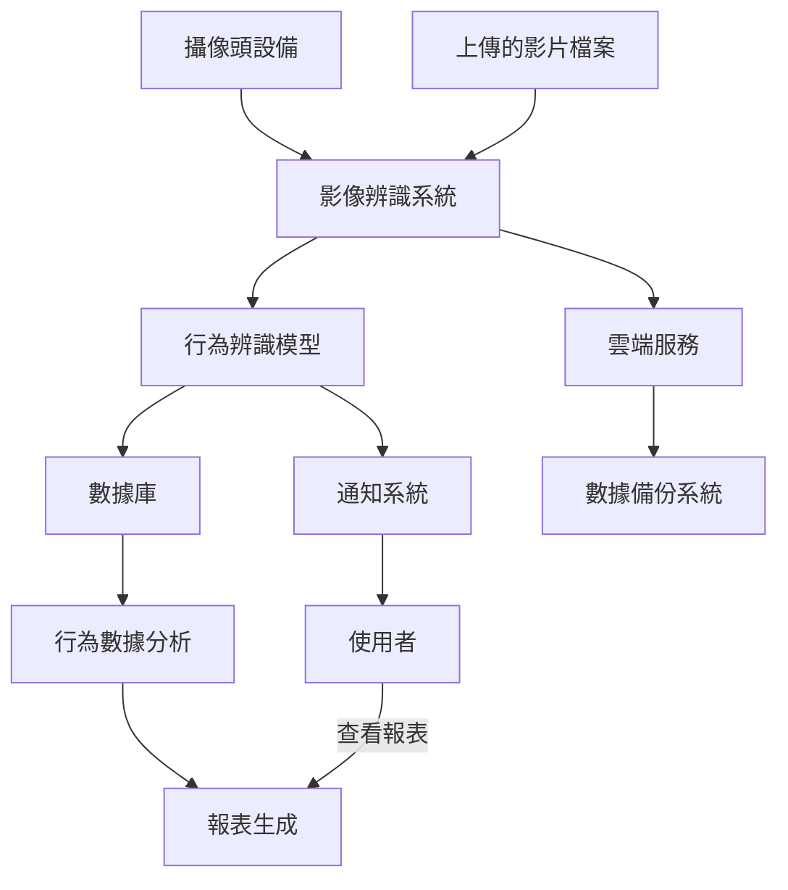
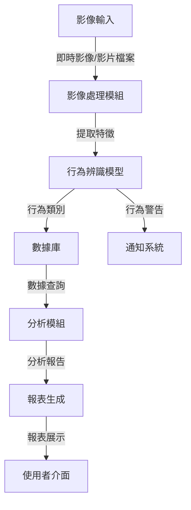

# 狗狗行為模式辨識系統 - 系統環境圖

```mermaid
graph TD
    User[使用者]
    Camera[攝像頭設備] --> System[影像辨識系統]
    File[上傳的影片檔案] --> System
    System --> AI[行為辨識模型]
    AI --> Database[數據庫]
    AI --> Notification[通知系統]
    Notification --> User
    Database --> Analysis[行為數據分析]
    Analysis --> Report[報表生成]
    User -->|查看報表| Report
    System --> Cloud[雲端服務]
    Cloud --> Backup[數據備份系統]
```
#狗狗行為模式辨識系統 - 資料流向資圖

```mermaid
graph TD
    A[影像輸入] -->|即時影像/影片檔案| B[影像處理模組]
    B --> |提取特徵| C[行為辨識模型]
    C --> |行為類別| D[數據庫]
    C --> |行為警告| E[通知系統]
    D --> |數據查詢| F[分析模組]
    F --> |分析報告| G[報表生成]
    G --> |報表展示| H[使用者介面]
```
